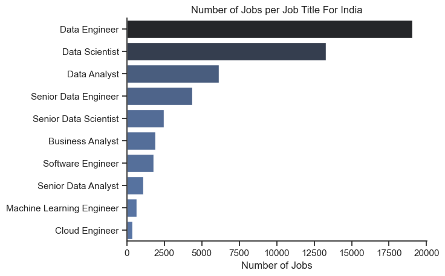
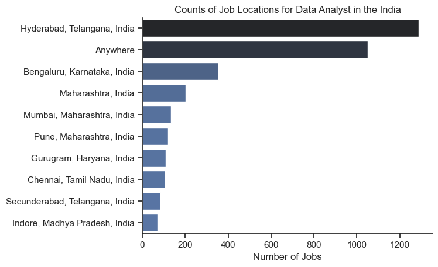

## ⭐Introduction⭐
* Recently, I made a pivotal decision to shift gears from my role as a design engineer to pursue opportunities in the data-oriented job market. This leap sparked numerous questions: How prevalent are these roles? Are they accessible in India? What sort of compensation can one expect? And crucially, what skills should I focus on learning? Fortunately, my quest for answers led me to stumble upon a comprehensive dataset compiled by Luke Barousse, meticulously detailing job trends for the year 2023 worldwide.

* This dataset includes average salaries, diverse job roles, and essential skills demanded in the industry. It’s a guiding beacon for newcomers like myself, offering invaluable insights to navigate this transformative career path with confidence and clarity.
I focused my attention on the data analyst role during my exploration into the realm of data-oriented careers. However, if you are interested in roles such as data engineer, data scientist, or others, I encourage you to customize the analysis to suit your interests. Using Python scripts, I conducted a detailed investigation into critical aspects such as the most in-demand skills, salary trends, and the intersection of demand with earning potential in data analytics. This analysis aims to provide clear insights for individuals looking to transition into a data-oriented career path.

## 🤔Questions I Had🤔
Here are the questions I aimed to answer for a data analyst role in India:
* 1.	I wanted to conduct an exploratory data analysis on job counts related to data-oriented jobs in India. My goal was to identify which states offer better opportunities in terms of job postings. Additionally, I was curious about whether a specialized degree is required for these roles and if work-from-home options are still available. Lastly, I aimed to discover which companies had done most of the recruitment for these roles in 2023.
* 2.	What skills do I need to develop for a data analyst role?
* 3.	Once I acquire these skills, how will they trend in the data analyst job market?
* 4.	How well do jobs and skills pay for Data Analysts?
* 5.	What are the most valuable skills for data analysts to learn? (In high demand and offering high pay)
     
## 🛠️Tools I Used🛠️
In my deep exploration of the data analyst job market, I employed a suite of powerful tools:
*	**Python** was the cornerstone of my analysis, enabling robust data manipulation and insightful discoveries. Supporting Python, I utilized:
    *  **Pandas** library for efficient data analysis.
    *  **Matplotlib** for clear and informative data visualizations.
    *  **seaborn** for advanced data visualization techniques.
* **Jupyter Notebooks** provided an interactive platform for code execution and detailed annotations.
*	**Visual Studio Code** for seamless script development and execution.
*	**Git and GitHub**, facilitating efficient sharing and tracking of my Python scripts and analysis.

These tools empowered me to deeply understand trends and patterns within the data analyst job landscape.

## 🧹Data Preparation and Cleanup🧹
This section details the steps I took to prepare the data for analysis, ensuring accuracy and usability.
```python
## Import and Clean Up Data
# Importing Libraries
import ast
import pandas as pd
from datasets import load_dataset
import matplotlib.pyplot as plt  
import seaborn as sns

# Loading Data
dataset = load_dataset('lukebarousse/data_jobs')
df = dataset['train'].to_pandas()

# Data Cleanup
df['job_posted_date'] = pd.to_datetime(df['job_posted_date'])
df['job_skills'] = df['job_skills'].apply(lambda x: ast.literal_eval(x) if pd.notna(x) else x)
```

## 🇮🇳 “Focus on India’s Job Market” 🇮🇳
I wanted to focus on jobs in the Indian market, so I filtered the dataset accordingly.
```python
df_ind = df[df['job_country'] == 'India'].dropna(subset='salary_year_avg')
```
## 🔍Analysis🔍
Each Jupyter notebook in this project was designed to investigate specific aspects of the data job market. Here’s how I approached each question:
## 1. 📊Exploratory Data Analysis📊
To explore the state of the job market in India, I investigated several key areas:
1.	The Job Market for Various Data-Related Roles in India.
2.	The Indian cities prominent in hiring for these roles 3
3.	Availability of remote job options and specialized degree requirements for these roles
4.	Companies that actively hired data analysts in 2023.
### 📈 1.The Job Market for Various Data-Related Roles in India
The first question that often arises when considering a career change is the number of job postings and the demand for the new role. To address this, I analyzed the number of positions posted in 2023 for data-oriented roles.

### 📺 Visualize Data
``` python
df_plot = df[df['job_country'] == 'India']['job_title_short'] .value_counts().to_frame()
print(df_plot)
sns.set_theme(style='ticks')
sns.barplot(data=df_plot, x='count', y='job_title_short', hue='count', palette='dark:b_r', legend=False)
sns.despine()
plt.title('Number of Jobs per Job Title For India')
plt.xlabel('Number of Jobs')
plt.ylabel('')
plt.show()
```
### 📺 Results


 
### 🔬Insights:
•	High Demand for Engineering Roles: Data engineering roles dominate the job market, suggesting that organizations are heavily investing in building robust data infrastructures.
•	Strong Demand for Analytical Roles: Data scientists and analysts are also in high demand, underscoring the importance of extracting insights from data.
•	Specialization and Experience Matter: Senior roles in data engineering and data science show significant demand, indicating that experience and specialization are highly valued.
•	Emerging Technologies: Roles like machine learning engineers and cloud engineers, while fewer in number, highlight the industry’s shift towards advanced analytics and cloud-based solutions.

### 2. 🏙️The Indian cities prominent in hiring for these roles🏙️
Given the significant demand for data-oriented roles, the next question is: which state or city is the front-runner in offering these jobs? Identifying these locations is crucial as they likely offer better exposure and career growth opportunities in data technologies.
### 📺 Visualize Data
```python
df_DA_ind= df[(df['job_country'] == 'India') & (df['job_title_short'] == 'Data Analyst')]
df_plot = df_DA_ind['job_location'].value_counts()[1:].head(10).to_frame()

sns.set_theme(style='ticks')
sns.barplot(data=df_plot, x='count', y='job_location', hue='count', palette='dark:b_r', legend=False)
sns.despine()
plt.title('Counts of Job Locations for Data Analyst in the India')
plt.xlabel('Number of Jobs')
plt.ylabel('')
plt.show()
```
### 📺 Results
 
🔬 Insights:
•	Hyderabad, Telangana, has the highest number of Data Analyst job postings, indicating it is a major hub for Data Analyst positions in India.
•	The “Anywhere” category has the second-highest number of job postings, highlighting the availability of remote or location-independent Data Analyst positions. This trend may reflect the growing acceptance of remote work in the industry.
•	Bengaluru, Karnataka, shows many job postings, making it another key location for Data Analyst roles. Bengaluru is known for being a major tech hub in India, which aligns with this demand.
•	Maharashtra, including specific cities like Mumbai and Pune, has a significant number of job postings. This indicates a strong demand for Data Analysts in this state, especially in its major cities. *Other cities with notable job postings include Gurugram (Haryana), Chennai (Tamil Nadu), Secunderabad (Telangana), and Indore (Madhya Pradesh). This suggests that opportunities for Data Analysts are spread across various major cities in India.
3 🌐 Availability of remote job options and specialized degree requirements for these roles🌐
•	Having noticed that remote work opportunities have become increasingly prevalent, prompting my curiosity about the overall percentage of jobs that offer remote options. Additionally, I’m interested in understanding whether a specialized degree is typically required to qualify for data analyst roles.
📺 Visualize Data
dict_column = {
    'job_work_from_home': 'Work from Home Offered for Data Analyst Role in India',
    'job_no_degree_mention': 'Degree Requirement for Data Analyst Role in India',
    }

fig, ax = plt.subplots(1, 2)
fig.set_size_inches((12, 5))

for i, (column, title) in enumerate(dict_column.items()):
    ax[i].pie(df_DA_ind[column].value_counts(), labels=['False', 'True'], autopct='%1.1f%%', startangle=90)
    ax[i].set_title(title)

plt.show()
📺Results
 
🔬 Insights:
•	A large majority of data analyst positions in India require on-site work rather than offering remote work options.
•	More than half of the data analyst positions are open to candidates without a formal degree, but a considerable number still mandate a degree as a prerequisite.
4.📅 Companies that actively hired data analysts in 2023 📅
Now, I’m curious about an analysis that can help me monitor companies on job platforms like LinkedIn, focusing on how often they hire for the data analyst role. As a fresher, it’s challenging to gauge the domain expertise of various IT companies, so this information would greatly assist me in identifying companies that prioritize hiring for data analyst positions.
📺Visualize Data
df_plot = df_DA_ind['company_name'].value_counts().head(10).to_frame()


sns.set_theme(style='ticks')
sns.barplot(data=df_plot, x='count', y='company_name', hue='count', palette='dark:b_r', legend=False)
sns.despine()

plt.title('Counts of Companies for Data Analyst in India')
plt.xlabel('Number of Jobs')
plt.ylabel('')
plt.show()

📺 Results
 
🔬 Insights:
•	The Data Analyst roles across these companies demonstrate a diverse orientation towards several key industries.
•	Financial services and analytics are prominently represented by companies like S&P Global, JPMorgan Chase, and Wells Fargo, where data analysts focus on financial data, risk management, and customer insights.
•	IT services and consulting roles are evident in companies like SAZ India, Maxgen Technologies, and Ovidtech Technologies, emphasizing data solutions, client projects, and internal data management.
•	Market and consumer analytics are targeted by companies like PepsiCo, concentrating on supply chain analysis, market trends, and consumer behaviour.
•	Education and assessment analytics are likely the focus within Prometrics Solutions, involving educational data and performance metrics.
•	This indicates the widespread and versatile demand for Data Analysts in multiple professional settings. Note: I’ve narrowed down my analysis to the top 10 companies, but further exploration can provide a comprehensive list of companies actively hiring for data analyst roles.
2. 🛠️ What skills do I need to develop for a data analyst role?️
Knowing that there’s a growing demand for data analysts across various industries naturally leads to the question: what specific skill set is most sought after for this role?
📺 Visualize Data

import seaborn as sns

fig, ax = plt.subplots(len(job_titles),1)

sns.set_theme(style='ticks')

for i, job_title in enumerate(job_titles):
    df_plot= df_skills_per[df_skills_per['job_title_short'] == job_title].head(5)
    sns.barplot(data = df_plot, x ='skill_per', y = 'job_skills', ax =ax[i], hue='skill_count', palette='dark:b_r' )
    ax[i].set_title(job_title)
    ax[i].set_ylabel('')
    ax[i].set_xlabel('')
    ax[i].legend().set_visible(False)
    ax[i].set_xlim(0,80)
    
    for index, value in enumerate(df_plot['skill_per']):
        ax[i].text(value+1, index, f'{value: .0f}%', va='center' ) # Value+1 to set position of the text away from the bar

    if i != len(job_titles)-1:
        ax[i].set_xticks([])

fig.suptitle('Likelihood of Skills Requested in India Job Postings', fontsize=15)
fig.tight_layout(h_pad=0.5)
plt.show()
📺 Results
 
🔬Insights:
•	It appears that SQL stands out as the most requested skill for both Data Analysts and Data Scientists, featuring in over half of job postings for each role.
•	Python, on the other hand, emerges as crucial primarily for Data Scientists, being sought after in 70% of job listings.
•	Data Engineers, however, require more specialized technical proficiencies such as AWS, Azure, and Spark, indicating a distinct focus on advanced data management tools compared to their counterparts in data analysis and science.
•	Python remains versatile across all three roles but is particularly emphasized for Data Scientists and Data Engineers, with significant demand noted in both domains.
3.📈 Once I acquire these skills, how will they trend in the data analyst job market?
In this uncertain environment, it’s essential to identify skills that will remain relevant, avoiding those that are becoming obsolete. I conducted a trend analysis of skills to understand their ongoing demand.
📺 Visualize Data
df_plot = df_DA_Ind_per.iloc[:, :5]

sns.lineplot(data=df_plot, dashes=False, palette= 'tab10')
sns.set_theme(style='ticks')
sns.despine()
plt.title('Trending Top Skills for Data Analysts in India')
plt.ylabel('Likelihood in Job Posting')
plt.xlabel('2023')
plt.legend().remove()

from matplotlib.ticker import PercentFormatter

ax = plt.gca()
ax.yaxis.set_major_formatter(PercentFormatter(decimals=0))


for i in range(5):
    plt.text(11.5, df_plot.iloc[-1, i], df_plot.columns[i])
📺 Results
 
🔬Insights:
•	SQL maintains its position as the consistently most in-demand skill throughout the year, with some gradual fluctuations in its popularity.
•	Excel saw a notable surge and subsequent decline in demand around May and June, briefly surpassing both Python and Tableau before stabilizing with minor fluctuations.
•	Python and Tableau demonstrate steady increases in demand throughout the year, with occasional minor variations, cementing their importance for data analysts.
•	Power BI, although less sought after than others, shows a slight upward trend towards the end of the year, indicating a potential catch-up with visualization tools like Tableau.
4.💰 How well do jobs and skills pay for Data Analysts?
Now that I have understood the skills required to qualify for a data analyst position, I’m also interested in exploring salary distributions for various roles in data-oriented positions. Additionally, I want to identify the skill sets that contribute to higher-paying jobs in data analysis.
📺Visualize data
sns.boxplot(data=df_ind_top6, x='salary_year_avg', y='job_title_short', order= job_order)
sns.set_theme(style='ticks')

# this is all the same
plt.title('Salary Distributions in the India')
plt.xlabel('Yearly Salary (USD)')
plt.ylabel('')
plt.xlim(0, 600000) 
ticks_x = plt.FuncFormatter(lambda y, pos: f'${int(y/1000)}K')
plt.gca().xaxis.set_major_formatter(ticks_x)
plt.show()
📺Results
 
🔬Insights:
•	Senior Data Engineer Salaries:
o	Highly consistent overall, indicating standardized pay structures or similar job responsibilities with minimal variation.
o	The presence of outliers suggests some earn significantly more, possibly due to specialized skills or higher responsibilities, compared to the majority within the core salary range.
•	Data Scientists:
o	enjoy a salary range from moderate to high, showing variability with notable outliers for higher earnings. Compared to Data Engineers, their main salary range is more consistent, reflecting stable compensation norms.
•	Data Analyst:
o	Data Analysts typically earn less than Data Scientists and Data Engineers. While occasional outliers indicate opportunities for higher earnings, the main salary distribution remains narrower and more consistent.
•	Machine Learning Engineer:
o	Machine Learning Engineers exhibit a wide salary range with significant variability suggested by a broad interquartile range. While outliers indicating very high earnings are currently absent.
•	Software Engineer:
o	Software Engineers have the lowest median salary among the roles listed, with a narrower salary spread indicated by the IQR and whiskers, possibly influenced by the dataset’s focus on data-oriented positions.
💼Highest Paid & Most Demanded Skills for Data Analysts💼
Next, I refined my analysis to focus exclusively on data analyst roles. I examined both the highest-paid skills and the most sought-after skills, presenting findings using two bar charts for clarity.
📺Visualize Data
fig, ax = plt.subplots(2, 1)  

sns.set_theme(style='ticks')

# Top 10 Highest Paid Skills for Data Analysts
sns.barplot(data=df_DA_top_pay, x='median', y=df_DA_top_pay.index, hue='median', ax=ax[0], palette='dark:b_r')
ax[0].legend().remove()
ax[0].set_title('Top 10 Highest Paid Skills for Data Analysts')
ax[0].set_ylabel('')
ax[0].set_xlabel('')
ax[0].xaxis.set_major_formatter(plt.FuncFormatter(lambda x, _: f'${int(x/1000)}K'))


# Top 10 Most In-Demand Skills for Data Analysts
sns.barplot(data=df_DA_top_skills, x='median', y=df_DA_top_skills.index, hue='median', ax=ax[1], palette='light:b')
ax[1].legend().remove()
ax[1].set_title('Top 10 Most In-Demand Skills for Data Analysts')
ax[1].set_ylabel('')
ax[1].set_xlabel('Median Salary (USD)')
ax[1].set_xlim(ax[0].get_xlim())  # Set the same x-axis limits as the first plot
ax[1].xaxis.set_major_formatter(plt.FuncFormatter(lambda x, _: f'${int(x/1000)}K'))

plt.tight_layout()
plt.show()
📺Results:
 
🔬Insights:
•	The skills that command high salaries s are indicative of advanced technical competencies, particularly in database management (PostgreSQL, MySQL, MongoDB, Neo4j), big data processing (PySpark, Scala), data governance (GDPR), and software development/DevOps (GitLab, Linux, Databricks).
•	The high demand for skills related to the role of the data analyst, such as Power BI, Tableau, and Excel, indicates a focus on data visualization and business intelligence.
•	Skills in Spark, SQL, Python, and R reflect the need for data manipulation, querying, and analysis capabilities.
•	The inclusion of cloud platforms like Azure and AWS signifies the industry’s shift towards cloud-based data solutions.
•	There is a clear difference between the highest-paid skills and the most in-demand skills for data analysts. To maximize career potential, data analysts should develop both high-paying specialized skills and widely demanded foundational skills.
5.💡What are the most valuable skills for data analysts to learn? (In high demand and offering high pay)💡
Having seen the demand for various skills and those that command higher salaries, the question arises: which skills have reasonably good demand and pay well? Identifying these skills can provide a strong head start for your career as a data analyst.
📺Visualize Data:

from adjustText import adjust_text

# df_DA_high_demand.plot(kind='scatter', x='skill_percent', y='median_salary')

sns.scatterplot(
    data= df_plot,
    x ='skill_percent',
    y = 'median_salary',
    hue = 'technology'
)

sns.despine()
sns.set_theme(style = 'ticks')

texts = []

for i, txt in enumerate(df_DA_high_demand.index):
    texts.append(plt.text(df_DA_high_demand['skill_percent'].iloc[i], df_DA_high_demand['median_salary'].iloc[i], txt))
adjust_text(texts, arrowprops=dict(arrowstyle='->', color='gray'))
     
# Set axis labels, title, and legend
plt.xlabel('Count of Job Postings')
plt.ylabel('Median Yearly Salary')
plt.title(f'Most optimal skills for data analysts in India')

# Get current axes
from matplotlib.ticker import PercentFormatter
ax = plt.gca()
ax.yaxis.set_major_formatter(plt.FuncFormatter(lambda y, pos: f'${int(y/1000)}K'))
ax.xaxis.set_major_formatter(PercentFormatter(decimals=0))

# Adjust layout and display plot 
plt.tight_layout()
plt.show()
📺 Results:
 
🔬 Insights:
•	The skill MongoDB appears to have the highest median salary of nearly $97K, despite being less common in job postings. This suggests a high value placed on specialized database skills within the data analyst profession.
•	Commonly required skills such as Excel, SQL, and Python are frequently mentioned in job listings but tend to have lower median salaries. In contrast, specialized skills like Power BI and Tableau are associated with higher salaries, although they appear moderately in job listings.
•	Skills such as PowerBi, Tableau, Spark and Looker are towards the higher end of the salary spectrum while also being fairly common in job listings, indicating that proficiency in these tools can lead to good opportunities in data analytics.
•	Analyst tools (coloured orange), such as Tableau and Power BI, are common in job postings and offer competitive salaries. These visualization and data analysis tools are crucial for data roles, providing good pay and versatility across various data tasks.
🎓What I Learned🎓
Throughout this project, I gained a deeper understanding of the data analyst job market and improved my technical skills in Python, particularly in data manipulation and visualization. Here are some specific insights I acquired:
Advanced Python Usage: Using libraries such as Pandas for data manipulation and Seaborn and Matplotlib for data visualization enabled me to perform complex data analysis tasks more efficiently.
Data Cleaning Importance: I discovered that thorough data cleaning and preparation are crucial for ensuring the accuracy of any insights derived from the data.
Strategic Skill Analysis: The project highlighted the importance of aligning skills with market demand. Understanding the relationship between skill demand, salary, and job availability allows for more strategic career planning in the tech industry.
🔍Insights🔍
This project offered several key insights into the job market for data analysts:
Skill Demand and Salary Correlation: There is a clear link between the demand for certain skills and the salaries they command. Advanced and specialized skills like MongoDB and Pyspark often result in higher pay.
Market Trends: The demand for skills is dynamic, reflecting the evolving nature of the data job market. Staying updated with these trends is crucial for career advancement in data analytics.
Economic Value of Skills: Knowing which skills are both in-demand and highly paid can help data analysts prioritize their learning to maximize economic returns.
🧩Challenges I faced🧩
This project presented several challenges but also offered valuable learning opportunities:
•	Data Inconsistencies: Addressing missing or inconsistent data entries requires careful attention and thorough data-cleaning techniques to maintain the integrity of the analysis.
•	Complex Data Visualization: Creating effective visual representations of complex datasets was challenging but essential for clearly and compellingly conveying insights.
📝Conclusion📝
This deep dive into the data analyst job market has been highly enlightening, revealing essential skills and trends that influence this dynamic industry. The insights gained not only enrich my understanding but also offer actionable advice for those aiming to progress in data analytics careers. As the market evolves, ongoing analysis will remain crucial for staying competitive in this field. This project serves as a solid groundwork for future explorations, emphasizing the significance of continuous learning and adaptation in the realm of data analytics.

